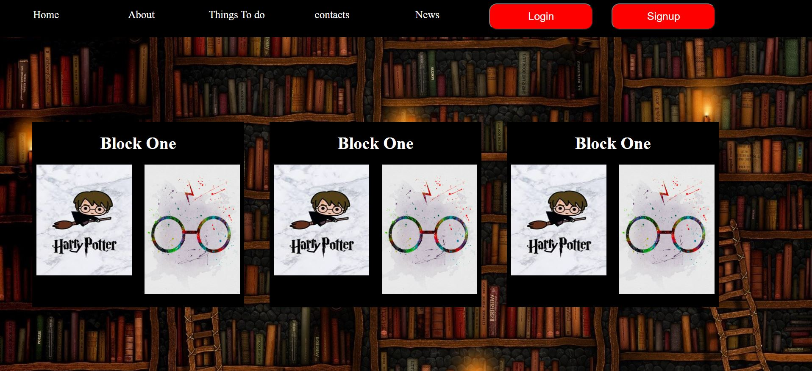
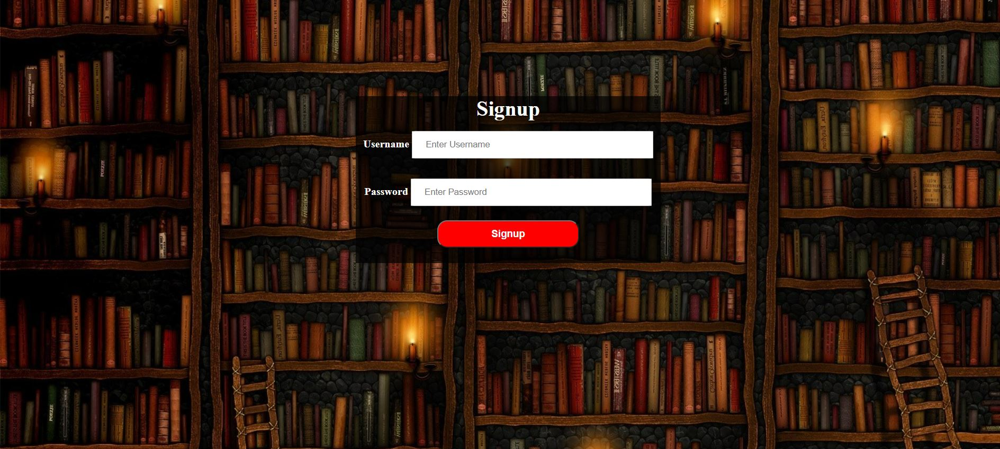
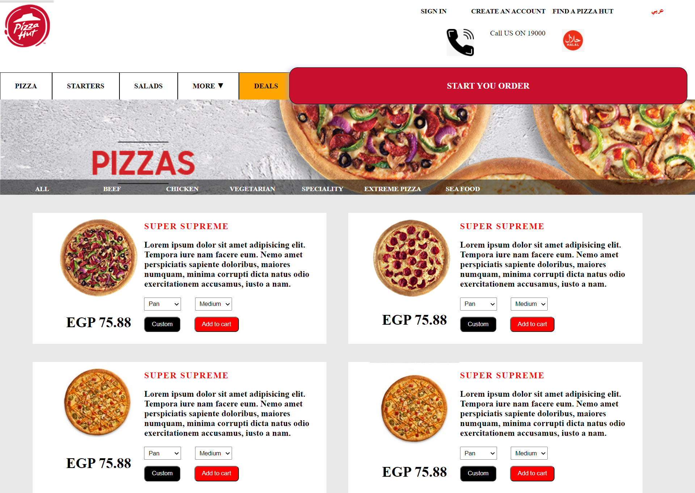

## Task One consists of 3 pages
> Main Page

> Login Page

> SignUp Page

## Task Two consists of Index Page

`Note: The Two main tasks are done usign postioning Relative and absolute as demanded in ITI labs`